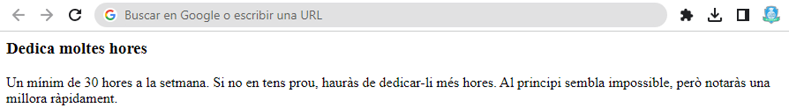
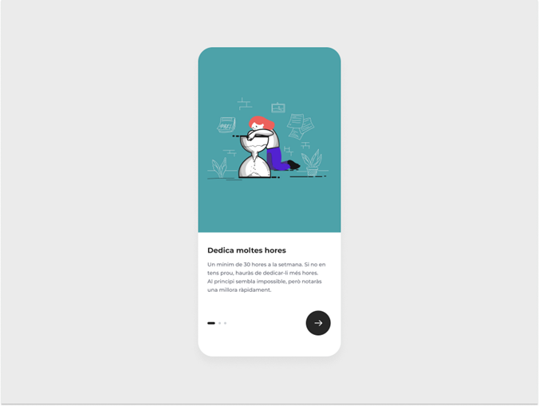

# S5. Onboarding digital React + TypeScript + Vite

La creació d'un Onboarding digital. Aquesta aplicació dispondrà de dos botons per a avançar o retrocedir a través de les frases, amb l'acompanyament d'una imatge que es modificarà.
A continuació, presentem un exemple de les 3 pantalles de l'aplicació. En el moment de la seva utilització, només es visualitzarà una pantalla a la vegada.

## Passos a seguir

1. Crear un component: Card.  ✔️

2. Carregar el component Card dins del component App.   ✔️

3. En el component App, defineix l'array tutorialData, que conté la informació de cada pas que es mostrarà a l'usuari.   ✔️

4. Crea el primer estat mitjançant el hook useState, per portar el compte del pas en què ens trobem.   ✔️

5. Passa mitjançant props les dades del primer pas al component Card.   ✔️

6. Utilitza a Card.js les dades proporcionades per props per mostrar a l'usuari el títol i la descripció del primer pas.   ✔️

This template provides a minimal setup to get React working in Vite with HMR and some ESLint rules.

## Resultat

Per ara, la teva aplicació pot mostrar només una frase. En aquest exercici farem que pugui mostrar totes les frases de l'onBoarding.

En aquest exercici farem que es vagin mostrant els diferents passos a l’usuari/ària.

1. Implementar una funció nextStep a App.js, que vagi incrementant el valor de l'estat step en una unitat.   ✔️

2. Passa per props al component Card, la funció nextStep i crida-la des del JSX del component Card. D'aquesta manera, quan l'usuari/ària faci clic al botó en el component Card, s'executarà la funció nextStep, que en modificar el valor de l'estat "step".✔️

3. Veuràs que passa el següent objecte de l'array tutorialData al component Card.

## Maquetar el component Card

Has de maquetar el component Card de forma responsive. ✔️

## Ara cal programar la funcionalitat que permet retrocedir un pas en el tutorial

Crea la funció prevStep al component App, similar a nextStep, però que resti una unitat a l'estat step cada vegada que s'executa.
Passa aquesta funció al component Card mitjançant props i fer-los servir en el JSX.
Hauràs de fer ús del renderitzat condicional per mostrar i amagar els botons de retrocedir i avançar.

1. Pas 1: només es mostra el botó d'avançar.   ✔️
2. Pas 2: es mostren els botons d'avançar i retrocedir.   ✔️
3. Pas 3: es mostra el botó de retrocedir.   ✔️

## Implementa l'indicador del pas en què ens trobem

1. Crea el component Indicator.js i carrega'l dins del component Card.✔️

2. Passa per props la quantitat de passos del tutorial (tutorialData.length o tutorailData) i el pas en què ens trobem (step).✔️

3. Amb les dades proporcionades per les propietats, pinta dinàmicament el número de boletes utilitzant un .map.✔️

4. Destaca la boleta on ens trobem fent servir styled components.✔️

## Afegir noves funcionalitats

1. Necessitem que en fer clic a cada boleta es mostri la frase corresponent.

2. Crea una animació entre els diferents passos d'introducció, fent que la imatge de la Card desaparegui per l'esquerra, i la següent aparegui per la dreta.

3. Opcional: també seria interessant animar el canvi en l'indicador del pas en què ens trobem.
